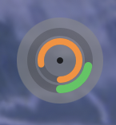
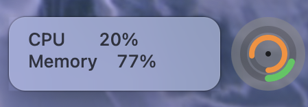
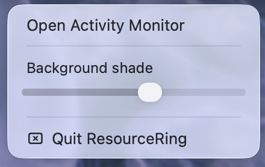

# ResourceRing

A tiny native macOS overlay for CPU and memory usage.





- Outer ring: CPU usage
- Inner ring: memory usage
- Green / orange / red: increasing resource pressure
- Hover: exact percentages
- Click: open Activity Monitor
- Drag: move the ring anywhere on screen
- Right-click: open the menu and choose **Quit ResourceRing**
- Adjustable background shade that is remembered between launches



## Run

```sh
chmod +x build.sh
./build.sh
open ResourceRing.app
```

It initially appears at the true bottom-right edge of the display, level with the Dock, and stays visible across Spaces and full-screen apps. After you drag it, ResourceRing remembers that position between launches and display-layout changes.

## Controls

- **Hover** over the ring to reveal live CPU and memory percentages.
- **Click** the ring to open Activity Monitor.
- **Drag** the ring to reposition it. Releasing after a drag will not open Activity Monitor.
- **Right-click** the ring and choose **Quit ResourceRing** to close it when launched by double-clicking.
- **Right-click** and adjust **Background shade** to blend the ring with your wallpaper. The setting is remembered between launches.

If you launched it from Terminal, you can also stop it with `Control-C`.
